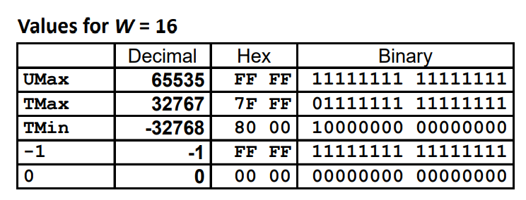
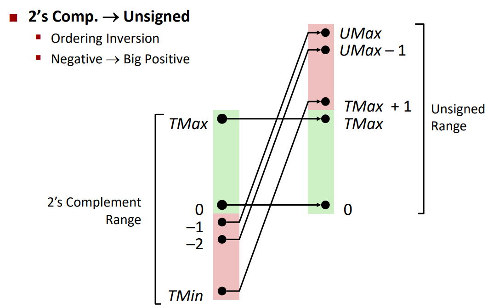

[toc]

# Labs

## XOR

Using only ~ and & compute xor:
$$
\begin{aligned} 
a \oplus b&=(a \vee b) \wedge \urcorner(a \wedge b)\\
		  &=(\overline{\urcorner a \wedge \urcorner b}) \wedge \urcorner(a \wedge b)
\end{aligned}
$$

> De Morgan's laws
>
> $\overline{A \cup B} = \overline A \cap \overline B$
>
> $\overline{A \cap B} = \overline A \cup \overline B$

## IsTmax

Tmax = 0x7FFF'FFFF

Tmax + 1 = 0x8000'0000

Tmax + 1 + Tmax + 1 = 0x0000'0000

!(Tmax + 1 + Tmax + 1) = 1

So far so good,except: 

if val = -1 (0xFFFF'FFFF)

!(val + 1 + val + 1) = 1

So this corner case should be handled by !!(Tmax + 1), which means Tmax + 1 != 0

## AllOddBits

Only **all** odd bits are 1 return true. Limit by using only given ops:

- return true when result is 0
- return false when result is non-zero

Construct a expression, when all odd bits of pass in number are 1, return 0.

- pick up all odd bits
  - Caution: bits from 0 to 31 for int, which means all odd bits will be picked by  0xAAAA'AAAA
  - Construct a mask 0xAAAA'AAAA to pick up odd bits

- flip input x to make all odd bits zero (if original input odd bits are all 1) to return 0

## Negate

x + y = 0

x + (~x) = 0xFFFF'FFFF

0xFFFF'FFFF + 0x1 = 0

x + (~x) + (0x1) = 0

y = -x = ~x + 1

## IsAsciiDigit

0x30 : 0

0x39: 9

0x30: 0x0011'0000

0x39: 0x0011'1001

0 ~ 9: 0x0011'0### ~ 0x0011'100#

- 0x0011'0###

  The 0011'0 part is helpful, using >> 3 to drop uninterested zone. 

  Now it turns to be 0x0000'0110 (0x6)

- 0x0011'100#

  The 0011'100 part is helpful, using >> 1 to drop uninterested zone. 

  Now it turns to be 0x0001'1100 (0x1C)

if the result is 0x6 or 0x1C after shifting right, it must be a digit.

## Conditional

If x != 0, return y; if x == 0, return z

Construct a expression:

- case 1: If x!=0, return 0xFFFF'FFFF & y
- case 2: If x==0, return 0xFFFF'FFFF & z

when x ==0, ~x = 0xFFFF'FFFF, case 2 solved.

If x != 0, !x = 0, ~(!x) = 0xFFFF'FFFF , looks like case 1 solved.

Since it's forbidden to use "if" keyword, case 1 and case 2 must be mutually exclusive. 

0xFFFF'FFFF and 0 are needed at the same time (which shuold be generated by x) .

So we need expression to turn x into  0 or -1 (0xFFFF'FFFF).

- using !!x to generate a 0-1 value.
- using ~x + 1 to generate 0 or -1(0xFFFF'FFFF)

## IsLessOrEqual

Basic idea:

- Get -x using ~x+1
- Check sign bit of y-x
- Compare sign bit of y-x but also sign bit of x and y
  - If sign bit  of x and y are different, return true when x < 0
  - If sign bit of x and y are the same, return true if y-x >= 0

Caution:

**Arithmetic shift right** will replicate most significant bit on left, make sure we get 0-1 value using &1.

## LogicalNeg

Return 1 if x = 0, else return 0. So just needs to identify x = 0. 

If  x = 0 or x = 0x1000'0000 (Tmin), x = -x

- x = 0x8000'0000

  -x = ~x + 1 = 0x7FFF'FFFF + 1 = 0x8000'0000 = x

- x = 0

  -x = ~x + 1 = 0xFFFF'FFFF + 1 = 0 = x

If x = -x:

- -x | x = 0x0###'####

  some value with **sign bit is 0**.

If x != -x:

-  -x |x = 0x1###'####

  some value with **sign bit is 1**. (since -x and x will alway be positive and negative)

Using -x |x, we can identify x = 0 or x = 0x1000'0000.

Using sign bit, we can distinguish 0 and 0x1000'0000. 

**Arithmetic shift right** will replicate most significant bit on left, make sure we get 0-1 value using &1.

## HowManyBits

Basic idea:

- If x < 0, let x = ~x, so we can use the same strategy for both x > 0 and x < 0. 

- At least needs one bit for sign bit.

- Check high-order 16 bits

  - If is all zero, then drop them, search the low-order 16 bits.

  - If not all zero, at least needs the low-order 16 bits. 

    Then continue search the high-order 16 bits, split it into two parts, repeat all above steps.

- Until we search the final 1 bit.

Search steps: 32 - 16 - 8- 4 - 2 -1-0, then adds all required bits count together(including sign bit).

## FloatScale2

Basic idea:

(-1)^s M 2^E   *   (-1)^0 1.0 2^1 = (-1)^s (M*1.0) 2^(E+1)

Only exponent part increase 1.

- Pick up exp bits from input unsigned int.
- Pick up sign bit from input unsigned int.
- For NaN cases (exp=0xFF), return original input value.
- Else return (-1)^s (M*1.0) 2^(E+1).

# Basics

## Shift Operation

### Left shift x << y

- Throw away extra bits on left
- Fill with 0's on right

### Right shift x >> y

- Throw away extra bits on right
- Fill left with ...
  - **Logical shift**: **Fill with 0's on left**
  - **Arithmetic shift**: **Replicate most significant bit** on left

### Undefined behavior

Shift amount < 0 or >= word size

## Numeric ranges

For w bits:

| Item | Value       |
| :--- | :---------- |
| UMin | 0           |
| UMax | 2^w - 1     |
| TMin | -2^(w-1)    |
| TMax | 2^(w-1) - 1 |

### Observation

- |TMin| = TMax + 1

- UMax = 2 * TMax + 1

### Two's complement

### Casting

Casting between Signed and Unsigned:

- Bit pattern is maintained
- But reinterpreted
- Can have unexpected effects: adding or subtracting 2^w

**Expression containing signed and unsigned int: int is cast to unsigned.**

### Expending and Truncating

#### Expending

- Unsigned: zeros add
- Signed: sign extension (copies of MSB)

Both yield expected result.

#### Truncating

- Unsigned/signed: bits are truncated.
- Result reinterpreted (may yield unexpected result)
- Unsigned: mod operation
- Signed: similar to mod (if reinterpreted to unsigned value)

May yield unexpected result. 

